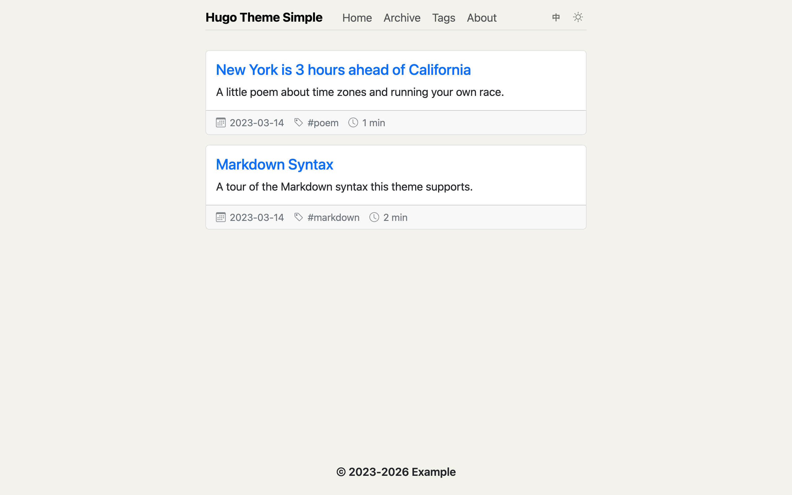
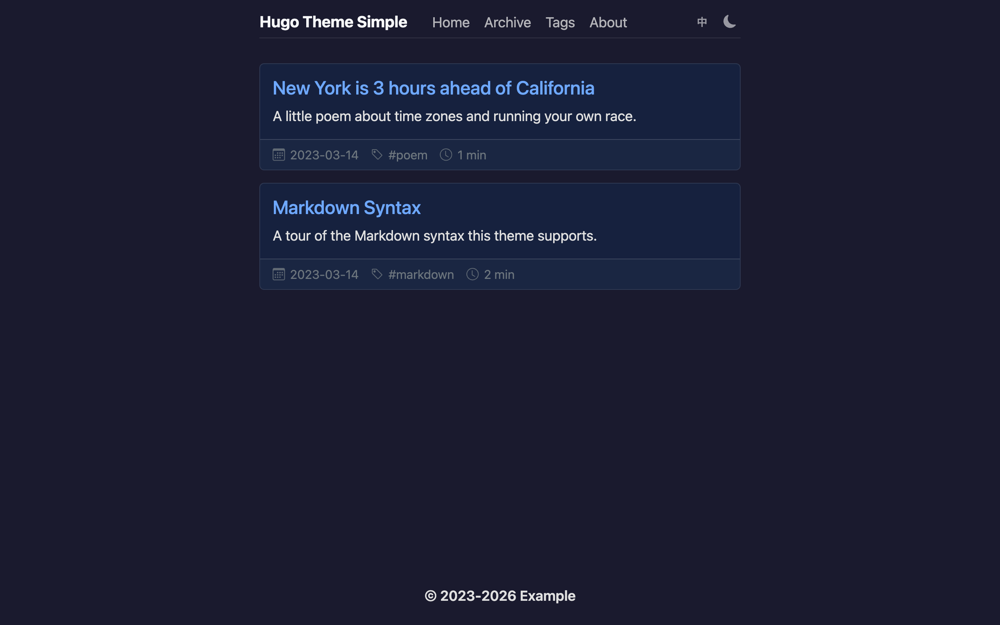

<h1 align="center">Hugo-Theme-Simple</h1>

[简体中文版本](./README.zh-CN.md)

## Introduction

This theme is named Simple. It is a clean, content-first blog theme built on Bootstrap 5.

Confucius once said, "Life is really simple, but we insist on making it complicated." With this in mind, our goal is to return to the essence of blogging and rediscover the original charm it holds. This theme embodies simplicity and elegance, allowing you to focus on what truly matters — your content.

**Live demo:** https://simple-is-awesome.github.io/Hugo-Theme-Simple/ (the bilingual `exampleSite`, deployed from this repo)

## Screenshots





## Features

- Hugo ≥ 0.158 (standard edition is enough, extended not required)
- Bootstrap 5.3, responsive and fast
- Multilingual with an automatic navbar language switcher; English and Chinese UI translations shipped, every string falls back to English
- Dark / light / system theme toggle, flash-free on page load
- Tags cloud page and year-grouped archive layout
- Collapsible table-of-contents sidebar (per-post `showtoc`)
- Per-post CC BY-NC-ND license box
- [utterances](https://utteranc.es) comments (theme follows dark/light mode automatically)
- Optional [emaction](https://github.com/emaction/emaction.frontend) emoji reactions
- Copy button on code blocks
- Lightbox for images
- RSS feeds, optionally styled in the browser with the bundled XSLT stylesheet
- "View as Markdown" raw-Markdown output for every post (optional)
- SEO-friendly head: OpenGraph, Twitter cards and hreflang alternates
- Back-to-top button
- Optional analytics: Google Analytics, Umami, Microsoft Clarity (production builds only)

## Requirements

- Hugo **0.158.0 or later**

## Installation

### Option 1: git submodule

```bash
# new a Hugo website
hugo new site your_site_name
# enter the site folder
cd your_site_name
# initialize a new git repo
git init
# add the theme as a submodule
git submodule add https://github.com/simple-is-awesome/Hugo-Theme-Simple.git themes/hugo-theme-simple
```

Then set the theme in your site config:

```toml
theme = "hugo-theme-simple"
```

### Option 2: Hugo module mounts

Instead of the `theme` key you can import the theme (still living in `themes/hugo-theme-simple`) through the module system, which lets you mount folders selectively and exclude files you do not need:

```yaml
module:
  imports:
    - path: hugo-theme-simple
      mounts:
        - source: layouts
          target: layouts
        - source: archetypes
          target: archetypes
        - source: i18n
          target: i18n
        - source: static
          target: static
          excludeFiles: # e.g. when you ship your own jQuery + Lightbox
            - js/jquery-4.0.0.min.js
            - js/lightbox.min.js
```

## Getting started

Copy the `exampleSite` folder to your Hugo site root folder and replace the default files, then run:

```bash
hugo server
```

The GIF below shows the install and getting-started steps:


Useful commands:

```bash
# create a new page
hugo new xxx.md
# create a new blog post in the blog folder
hugo new blog/xxx.md
```

## Configuration

The theme renders correctly with **zero** params set — everything below is optional.

### Site params (`[params]`)

| Param | Type | Default | Description |
| --- | --- | --- | --- |
| `mainSection` | string | `"blog"` | Content section used for the home listing, archive grouping, sidebar archive, post meta row, license box and prev/next navigation (comments render on all single pages once configured) |
| `footer` | string | unset | Footer copyright text; the `{Year}` placeholder is replaced with the current year, e.g. `"&copy; 2023-{Year} Example"` |
| `darkMode` | bool | `true` | Dark / light / system theme toggle (set `false` to remove it) |
| `backToTop` | bool | `true` | Floating back-to-top button |
| `showWordCount` | bool | `false` | Show the word count in post meta rows |
| `rssStylesheet` | bool | `false` | Style RSS feeds with the bundled XSLT stylesheet (English and Chinese shipped) |
| `utterances.repo` | string | unset | GitHub repo for [utterances](https://utteranc.es) comments; comments render only when set |
| `utterances.issueTerm` | string | `"pathname"` | utterances issue mapping |
| `utterances.label` | string | unset | Optional utterances issue label |
| `emaction.endpoint` | string | unset | Backend endpoint for emaction emoji reactions; the widget renders only when set |
| `umami.scriptURL` | string | unset | Umami script URL; emitted only when set, and only in production builds |
| `umami.websiteID` | string | unset | Umami website id (required together with `scriptURL`) |
| `clarity` | string | unset | Microsoft Clarity project id; emitted only in production builds |

### Google Analytics

Uses Hugo's built-in service config; emitted only in production builds:

```toml
[services.googleAnalytics]
  ID = "G-XXXXXXXXXX"
```

### Front matter

| Key | Description |
| --- | --- |
| `showtoc: true` | Show the collapsible table-of-contents sidebar for this post |
| `layout: "archive"` | On a section `_index.md`: render the year-grouped archive layout (see `exampleSite/content/blog/_index.md`) |
| `translationKey` | Links translations of the same post across languages (used by the language switcher and hreflang) |
| `slug`, `summary`, `tags` | The usual — see `archetypes/blog.md` |

## Feature guide

All features below are optional — the theme works with none of them configured.

### Multilingual & language switcher

The navbar language switcher appears automatically as soon as the site config defines more than one language — no extra params needed:

```toml
defaultContentLanguage = 'en'

[languages]
  [languages.en]
    languageName = "English"
    languageCode = "en-US"
    weight = 1
    title = "Hugo Theme Simple"
    [languages.en.params]
      languageLabel = "EN" # short switcher label shown on non-English pages
  [languages.zh]
    languageName = "中文"
    languageCode = "zh-CN"
    weight = 2
    title = "Hugo 简单主题"
    [languages.zh.params]
      languageLabel = "中" # short switcher label shown on non-Chinese pages
```

How it behaves:

- The default language stays at the site root; every other language lives under `/<lang>/`.
- The switcher is a compact toggle showing the target language's `languageLabel` (a short code like `EN` / `中`); when unset it falls back to that language's `languageName`.
- It links the **translation of the current page** when one exists, and falls back to that language's homepage otherwise — so it never 404s (e.g. on tag pages).
- `hreflang` alternates (including `x-default`, pointing at the default language) are emitted automatically for translated pages.
- Define menu entries with `pageRef` instead of `url` (see `exampleSite/config.toml`) — Hugo then resolves each language's real page URL, which also keeps menus working when the site is deployed under a subpath (e.g. a GitHub Pages project site).

Linking translations of a page:

- Same content folder: use the filename suffix convention — `about.md` ↔ `about.zh.md` are linked automatically.
- One `contentDir` per language: set the same `translationKey` in the front matter of each translation instead.

Titles, menus and params can all be set per language (`[languages.xx.menu]`, `[languages.xx.params]`). The `exampleSite` is configured bilingually (English / 中文) with fully separated content — the English site shows only English pages and the Chinese site only Chinese ones. Preview it for a complete working setup.

UI strings: the theme ships `i18n/en.yaml` and `i18n/zh.yaml`, matched by your language key (any key starting with `zh` can reuse the Chinese file by copying it, e.g. to `i18n/zh-hans.yaml`). Any other language falls back to English. To support one more language, copy `i18n/en.yaml` into your site's `i18n/<lang-key>.yaml` and translate the values — no template changes needed.

### Dark mode

On by default: a three-state toggle (light / dark / follow system) in the navbar. The choice is stored in `localStorage` and applied by an inline script before first paint, so pages never flash the wrong theme. utterances comments follow the chosen theme automatically. Set `darkMode = false` under `[params]` to remove the toggle and its script.

### Comments (utterances)

Comments are rendered on single pages once a repo is configured, using [utterances](https://utteranc.es) (GitHub-issue-backed, no ads, no tracking):

```toml
[params.utterances]
  repo = "your-github-name/your-repo" # required; install the utterances app on it
  issueTerm = "pathname"              # optional, default "pathname"
  label = "comment"                   # optional issue label
```

### Emoji reactions (emaction)

A lightweight GitHub-style 👍/🎉/❤️ reaction bar above the comments, powered by [emaction](https://github.com/emaction/emaction.frontend). Requires your own emaction backend:

```toml
[params.emaction]
  endpoint = "https://your-emaction-backend.example.com"
```

### Analytics

Three options, freely combinable. All of them are emitted **only in production builds** (`hugo`), never by `hugo server` or `--environment development`:

```toml
[services.googleAnalytics]
  ID = "G-XXXXXXXXXX"        # Google Analytics 4

[params]
  clarity = "your-project-id" # Microsoft Clarity

[params.umami]                # self-hosted Umami
  scriptURL = "https://umami.example.com/script.js"
  websiteID = "your-website-id"
```

### Styled RSS feeds

`rssStylesheet = true` under `[params]` makes feeds render as a readable page when opened in a browser, via a bundled XSLT stylesheet (self-contained, styles inlined). English and Chinese stylesheets ship: language keys starting with `zh` get the Chinese one, everything else gets English.

### Table-of-contents sidebar

Set `showtoc: true` in a post's front matter to render a collapsible TOC beside the content on desktop. The current section is highlighted while scrolling. Heading levels come from your `markup.tableOfContents` config (the exampleSite uses levels 2–3).

### Archive page

Create a section index with the archive layout, e.g. `content/blog/_index.md`:

```yaml
---
title: "Archive"
url: "/archive/"
layout: "archive"
---
```

Posts are grouped by year and month with per-year tag chips, plus a sticky year-jump sidebar on desktop.

On a multilingual site, write the language prefix into each translation's `url` yourself (e.g. `url: "/zh/archive/"` in `_index.zh.md`) — front-matter `url` values are used as-is and are not language-prefixed automatically.

### Back to top & word count

- `backToTop = false` removes the floating back-to-top button (on by default).
- `showWordCount = true` adds the word count to post meta rows (off by default; CJK-aware when `hasCJKLanguage` is set).

### "View as Markdown" output

To publish each post's raw Markdown next to its HTML (and get the "View as Markdown" link), add to your site config:

```yaml
uglyURLs: true
outputFormats:
  HTML:
    noUgly: true
  RSS:
    noUgly: true
  MarkdownRaw:
    mediaType: text/markdown
    isPlainText: true
    isHTML: false
```

and enable the output for your posts, e.g. in `content/blog/_index.md`:

```yaml
outputs:
  - HTML # the archive page itself stays HTML-only
cascade:
  outputs:
    - HTML
    - MarkdownRaw
```

## Deployment

A ready-made GitHub Actions workflow (`.github/workflows/hugo.yml`) builds the `exampleSite` and deploys it to GitHub Pages. Netlify and Vercel work just as well — see the Hugo docs on [Hosting & Deployment](https://gohugo.io/hosting-and-deployment/).

Happy blogging! :blush: :blush: :blush:

## Acknowledgements

The 2026 modernization of this theme — the Hugo 0.146+ layout migration, dark mode, multilingual support, the bilingual demo site and these docs — was pair-programmed with [Claude Code](https://claude.com/claude-code) running **Claude Fable 5**. Thanks, Claude! ❤️

## License

MIT
